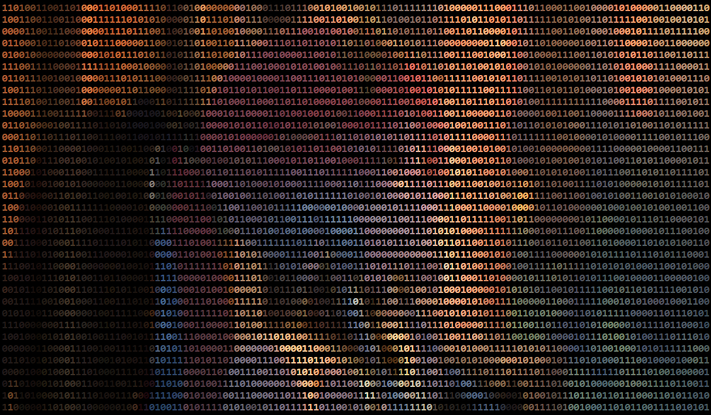

  
  ╔══════════════════════════════════════════════════════════════════════════════════════╗
  
  ╚══════════════════════════════════════════════════════════════════════════════════════╝

  

  
  

    
  

<h2 align="center">
   
  LANGUAGE & TOOLS
</h2>

  
⚡ FAVORITE LANGUAGE ⚡

  
  
  
🔮 TOOLS USED 🔮

  

  
  

<h2 align="center">
  
  MY MEDIA
</h2>

  
  
  

<picture>
  <source media="(prefers-color-scheme: dark)" srcset="https://raw.githubusercontent.com/letKliwyr/letKliwyr/output/github-contribution-grid-snake-dark.svg">
  <source media="(prefers-color-scheme: light)" srcset="https://raw.githubusercontent.com/letKliwyr/letKliwyr/output/github-contribution-grid-snake.svg">
  
</picture>

  

